# Dutch Rose Placeables Toolkit

## Introduction

## Installation

You can use the unity package manager to install the library:

1. Open package manager from Window -> Package Management -> Package Manager
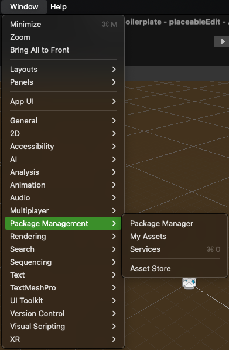{ width="300",align=right }

2. Choose the Plus Icon -> Install package from git URL...
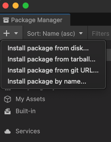{ width="300",align=right }

3. Copy the `TODO: git url` and hit install.

## Core Components Breakdown

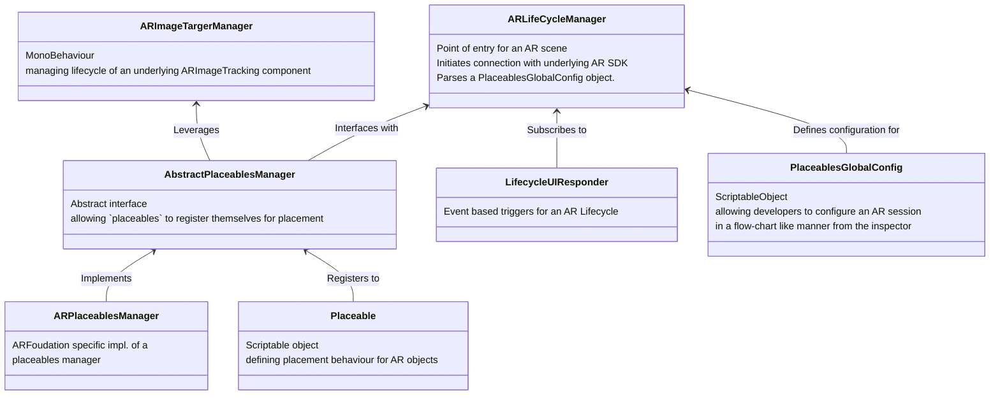

### PlaceablesGlobalConfig

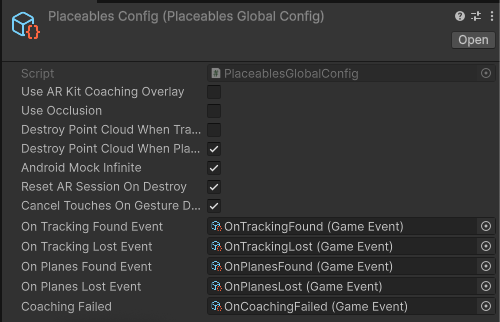

- **Use ARKit Coaching Overlay**: shows the iOS only Coaching Overlay when enabled, its functionality is detailed by Apple on [this url](https://developer.apple.com/documentation/arkit/arcoachingoverlayview)

- **Use Occlusion**: enables depth mask/occlusion techniques, this works better on more modern phones as it can use lidar/depth sensors.

- **DestroyPointCloudWhenTracking**: tells the `lifecyclemanager` to destroy the `point cloud` when tracking is first found.

- **DestroyPointCloudWhenPlanesFound**: tells the `lifecyclemanager` to destroy the `point cloud` when planes are first found.

- **AndroidMockInfinite**: mocks the non-existent `infinite plane` on android systems.

- **ResetARSessionOnDestroy**: destroy an AR session when the containing scene is unloaded.

- **CancelTouchesOnGestureDetection**: used when ‘pinching’ is enabled, prevents a touch on the screen from triggering multiple gestures at the same time.

- **On*Event**: a number a `GameEvents` allowing developers to respond to AR lifecycle events using the `SOArchitecture/Events/GameEvent.cs` Game Event system without having to write code. 

??? info "More about `GameEvents`"

    `GameEvents` is simply a concept to handle events in your application cleaner.
    It's a simple `ScriptableObject` with a listener alongside that can be invoked based on the events you want. OnTrackingFound and the rest of On* events are some use-cases of this pattern.

??? info "More info"
     Every AR scene always contains exactly one ARLifeCycleManager which initializes the AR foundation library when the scene loads.

### Placeables

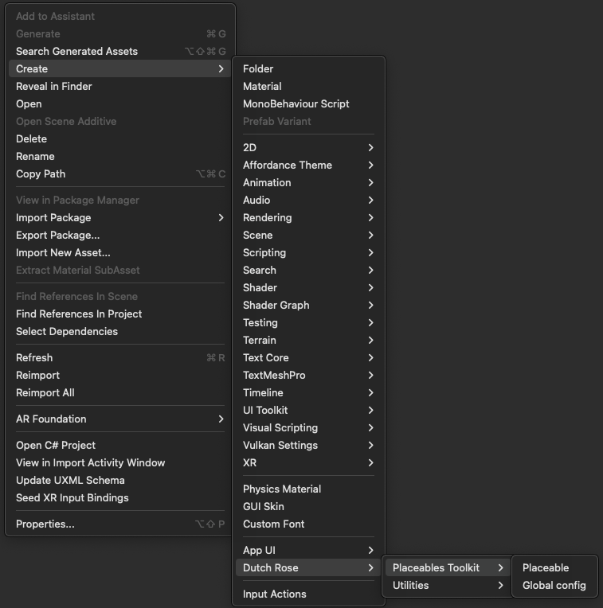

To simplify development in a codeless manner, the `Placeables` package lets developers define AR functionalities in a configurable manner from the inspector using `Placeable ScriptableObjects`. 

A placeable is an asset on the filesystem that can be supplied to an implementation of the `AbstractPlaceableManager` class. 

#### Placeables placement strategies

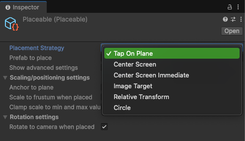

- **TapOnPlane**: Physically mark the place to instantiate an object by tapping.

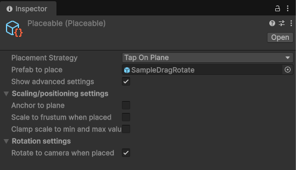

- **CenterScreen**: Drag an object around on the center of the screen, to then confirm placement by tapping.

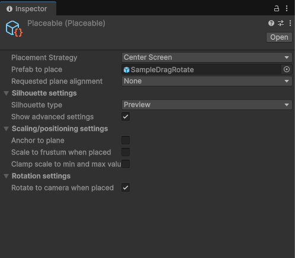

- **CenterScreenImmediate**: Instantiates an object using a raycast from the center of the screen. It does not ask the user to confirm and places immediately. 

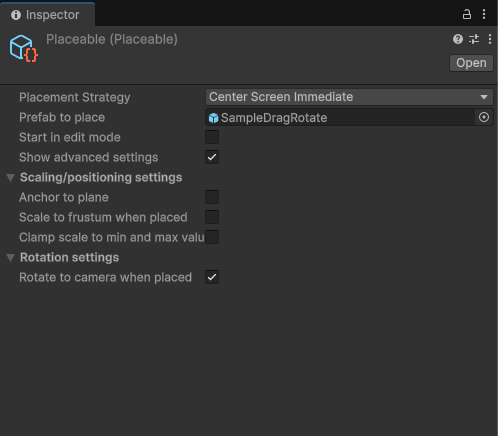

- **ImageTarget**: A PNG that will be used for imagetracking. The prefab is then placed when the ImageTargetManager finds said image in the camera view. 

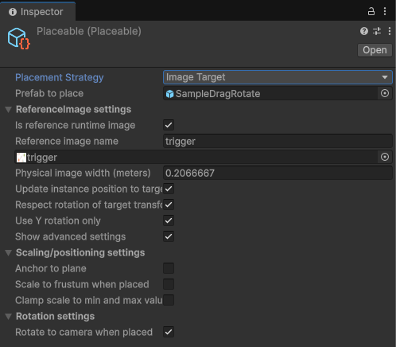

- **RelativeTransform**: Place an object at a given distance and rotation from the user (currently used by ByAR) 

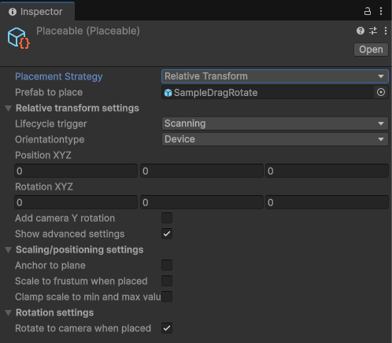

## Dependencies

- AR Foundation
- Google ARCore XR Plugin
- Apple ARKit XR Plugin
- XR Plugin Management
- Editor Coroutines
- XR Interaction Toolkit

